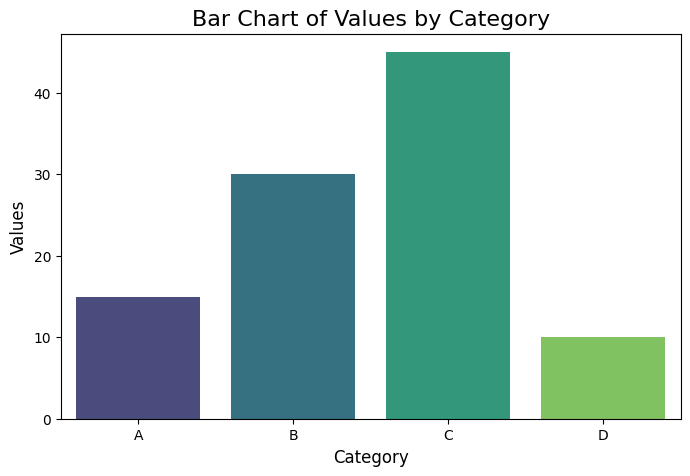

# Data-Exploration
## AIM:
To import, clean, explore, and visualize a dataset using Python and its libraries, demonstrating data handling, missing value treatment, and generating basic insights using statistical measures and visualizations.

## ALGORITHM:
1. Import Data: Load the dataset using pandas from CSV/Excel files and display its structure with .head().
2. Handle Missing Values: Identify missing values with .isnull() and handle them using .fillna() or .dropna().
3. Basic Exploration: Compute statistical measures like mean, median, and mode using .mean(), .median(), and .mode().
4. Visualize Data: Create bar, pie, and line charts using matplotlib and seaborn to identify patterns.
5. Interpret Results: Analyze statistical outputs and visual patterns to derive insights from the data.
## PROGRAM AND OUTPUT:
### A. Importing and Cleaning Data and Perform basic data exploration (mean, median, mode)
1. Tools: Python (Pandas), Excel
2. Do Load datasets (CSV, Excel) and Handle missing values

#### Step 1: Load Datasets (CSV, Excel)
```py
import pandas as pd
# Load CSV file
csv_file_path = 'sample_data.csv'
csv_data = pd.read_csv(csv_file_path)
# Load Excel file
excel_file_path = 'sample_data.xlsx'
excel_data = pd.read_excel(excel_file_path)
# Display the first few rows of the datasets
print("CSV Data:\n", csv_data.head())
print("\nExcel Data:\n", excel_data.head())
```
#### Step 2: Handle Missing Values
```py
# Example data (if you're simulating datasets)
data = {
    'Name': ['Alice', 'Bob', 'Charlie', None],
    'Age': [25, None, 30, 29],
    'Salary': [50000, 54000, None, 58000]
}
df = pd.DataFrame(data)

print("Original Data:\n", df)

# 1. Fill missing values with a default value
df_filled = df.fillna({'Name': 'Unknown', 'Age': df['Age'].mean(), 'Salary': df['Salary'].median()})
print("\nData after Filling Missing Values:\n", df_filled)

# 2. Drop rows with missing values
df_dropped = df.dropna()
print("\nData after Dropping Rows with Missing Values:\n", df_dropped)
```
#### Step 3: Perform Basic Data Exploration
```py
# Calculate Mean, Median, and Mode
mean_age = df['Age'].mean()
median_salary = df['Salary'].median()
mode_name = df['Name'].mode()[0]

print("\nBasic Data Exploration:")
print(f"Mean Age: {mean_age}")
print(f"Median Salary: {median_salary}")
print(f"Mode of Name: {mode_name}")
```
#### Sample Outputs (Based on Example Data)
1. Original Data


2. Data after Filling Missing Values


3. Basic Data Exploration Results
```
Mean Age: 28.0
Median Salary: 54000.0
Mode of Name: Alice
```
### B. Visualization Basics to Create charts (bar, pie, line) and Interpret visual patterns
Tools: Tableau/Matplotlib/Seaborn

#### Step 1: Import Libraries and Prepare Data
```py
import matplotlib.pyplot as plt
import seaborn as sns
import pandas as pd

# Example Data
data = {
    'Category': ['A', 'B', 'C', 'D'],
    'Values': [15, 30, 45, 10],
    'Time': ['2021', '2022', '2023', '2024'],
    'Growth': [100, 120, 150, 200]
}
df = pd.DataFrame(data)
```
#### Step 2: Bar Chart
Bar charts are used to compare categorical data.
```py
# Bar Chart
plt.figure(figsize=(8, 5))
sns.barplot(x='Category', y='Values', data=df, palette='viridis')
plt.title('Bar Chart of Values by Category', fontsize=16)
plt.xlabel('Category', fontsize=12)
plt.ylabel('Values', fontsize=12)
plt.show()
```


#### Step 3: Pie Chart
Pie charts are used to show proportions.
```py
# Pie Chart
plt.figure(figsize=(6, 6))
plt.pie(df['Values'], labels=df['Category'], autopct='%1.1f%%', colors=['gold', 'skyblue', 'lightgreen', 'pink'])
plt.title('Pie Chart of Values by Category', fontsize=16)
plt.show()
Interpretation
Category C makes up the largest portion, followed by B.
Category D is the smallest slice.
```


#### Step 4: Line Chart
Line charts are used to show trends over time.
```py
# Line Chart
plt.figure(figsize=(8, 5))
plt.plot(df['Time'], df['Growth'], marker='o', color='blue', label='Growth Over Time')
plt.title('Line Chart of Growth Over Time', fontsize=16)
plt.xlabel('Year', fontsize=12)
plt.ylabel('Growth', fontsize=12)
plt.legend()
plt.grid()
plt.show()
```
<b>Interpretation</b>
Growth shows a steady increase over the years.
Significant jump between 2023 and 2024.


## RESULT: 
The dataset was successfully imported, cleaned, and explored, with missing values handled using appropriate methods like filling or dropping. Statistical insights (mean, median, mode) were derived, and visualizations (bar, pie, line charts) highlighted trends and patterns effectively.

